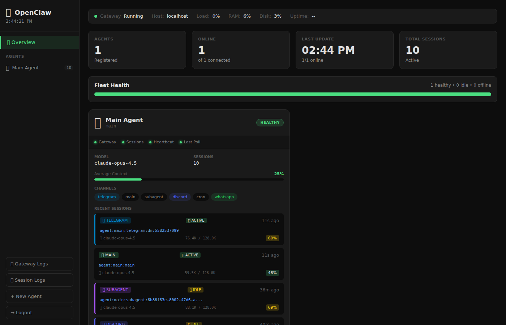
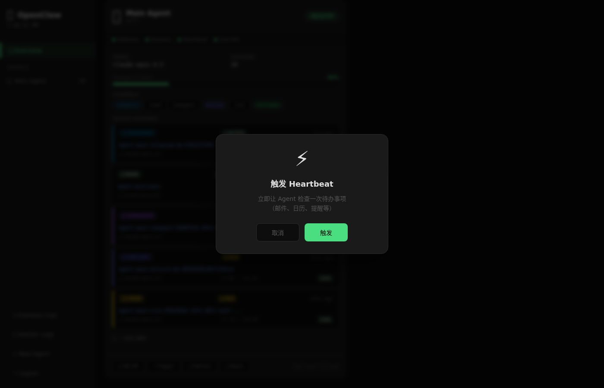
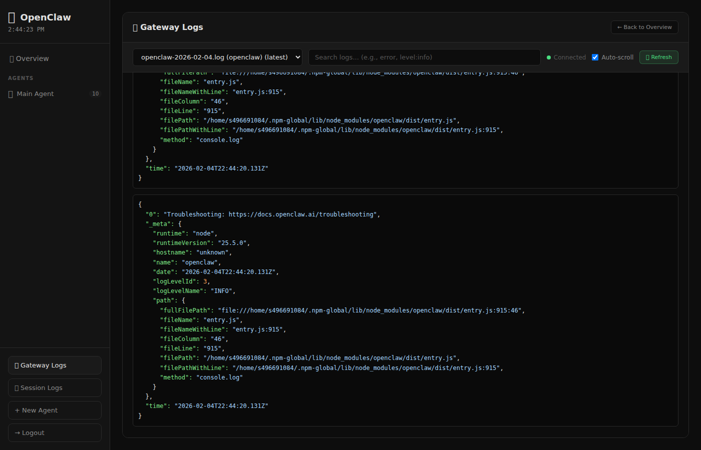

# 🐾 OpenClaw Dashboard

A beautiful, real-time web dashboard for monitoring and managing your [OpenClaw](https://github.com/openclaw/openclaw) AI agents.



## ✨ Features

### 📊 Agent Fleet Overview
- **Real-time agent status** - Monitor all your agents at a glance
- **Fleet health bar** - Visual indicator of healthy/idle/offline agents
- **Session tracking** - See active sessions with channel types (Telegram, Discord, WhatsApp, etc.)
- **Token usage** - Monitor context window usage with color-coded progress bars
- **Activity status** - 🟢 Active / 🟡 Idle / ⚫ Stale indicators

### 🎛️ Agent Controls
- **Heartbeat toggle** - Enable/disable periodic agent check-ins
- **Trigger heartbeat** - Manually trigger agent to check todos, emails, calendar
- **Refresh status** - Force refresh agent status
- **Reset sessions** - Clear conversation history (with double confirmation)



### 📋 Log Viewer
- **Gateway logs** - Real-time streaming via WebSocket
- **Session logs** - Browse and search individual session transcripts
- **JSON syntax highlighting** - Beautiful, readable log entries
- **Search** - Fast server-side search with highlighting



### 🖥️ System Metrics
- **CPU / Memory / Disk** - Real-time system resource monitoring
- **Gateway status** - Start/Stop/Restart controls
- **Host information** - Load average, uptime display

### 🔐 Security
- **Password authentication** - Secure access to your dashboard
- **Session-based auth** - Persistent login with cookies

## 🚀 Quick Start

### Prerequisites
- Node.js 18+
- OpenClaw installed and configured

### Installation

```bash
# Clone the repository
git clone https://github.com/CharlesYWL/openclaw-dashboard.git
cd openclaw-dashboard

# Install dependencies
npm install

# Start the server
node server.js
```

### Configuration

Set environment variables or edit `server.js`:

```bash
PORT=3456                    # Dashboard port (default: 3456)
DASHBOARD_PASSWORD=your_pw   # Access password
```

### Running with PM2 (Recommended)

```bash
# Install PM2 globally
npm install -g pm2

# Start with PM2
pm2 start server.js --name openclaw-dashboard

# Save for auto-restart
pm2 save
pm2 startup
```

## 🎨 UI Features

| Feature | Description |
|---------|-------------|
| 🌙 Dark theme | Easy on the eyes, optimized for monitoring |
| 📱 Channel badges | Color-coded: Telegram (blue), Discord (purple), WhatsApp (green) |
| 📊 Progress bars | Context usage with green/yellow/red thresholds |
| 🔔 Toast notifications | Non-intrusive status updates |
| 💫 Custom modals | Beautiful confirmation dialogs with animations |
| ⚡ Real-time updates | WebSocket-powered live log streaming |

## 🛠️ Tech Stack

- **Backend**: Node.js, Express
- **Frontend**: Vanilla JS, CSS3
- **Real-time**: WebSocket (ws)
- **Process**: PM2 (optional)

## 📁 Project Structure

```
openclaw-dashboard/
├── server.js           # Express server + API routes
├── public/
│   └── index.html      # Single-page dashboard app
├── screenshots/        # README images
└── package.json
```

## 🤝 Contributing

Contributions welcome! Feel free to:
- 🐛 Report bugs
- 💡 Suggest features
- 🔧 Submit pull requests

## 📄 License

MIT License - see [LICENSE](LICENSE) for details.

## 🔗 Links

- [OpenClaw](https://github.com/openclaw/openclaw) - The AI agent framework
- [OpenClaw Docs](https://docs.openclaw.ai) - Official documentation
- [Discord Community](https://discord.com/invite/clawd) - Get help & chat

---

Made with ❤️ for the OpenClaw community
