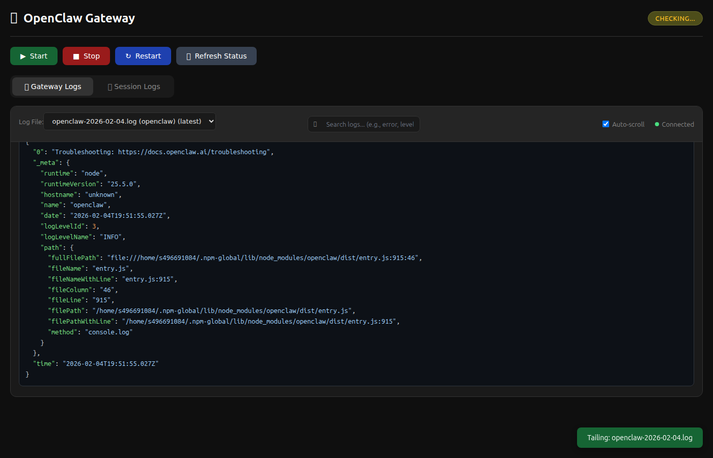

# 🐾 OpenClaw Gateway Dashboard

A sleek, real-time web dashboard for managing your [OpenClaw](https://github.com/openclaw/openclaw) Gateway.



## ✨ Features

| Feature | Description |
|---------|-------------|
| 📜 **Real-time Logs** | Live log streaming via WebSocket with auto-scroll |
| 🎨 **JSON Highlighting** | Syntax-highlighted JSON for easy reading |
| 🔍 **Log Search** | Fast server-side search with highlighting |
| 🎛️ **Gateway Controls** | Start / Stop / Restart with one click |
| 💬 **Session Logs** | View Discord & Telegram session transcripts |
| 📊 **Status Monitor** | Auto-refreshing connection status |

## 🚀 Quick Start

```bash
# Clone the repo
git clone https://github.com/CharlesYWL/openclaw-dashboard.git
cd openclaw-dashboard

# Install dependencies
npm install

# Start the server
node server.js
```

Open **http://localhost:3456** in your browser.

## 🌐 Remote Access

Access via Tailscale or any reverse proxy:

```
http://<your-tailscale-ip>:3456
```

## 🛠️ Tech Stack

- **Backend:** Node.js + Express + WebSocket (ws)
- **Frontend:** Vanilla HTML/CSS/JS (no frameworks!)
- **Search:** Server-side grep (~6ms for 5MB logs)

## 📡 API Reference

### REST Endpoints

| Method | Endpoint | Description |
|--------|----------|-------------|
| `GET` | `/api/status` | Gateway status |
| `POST` | `/api/gateway/start` | Start gateway |
| `POST` | `/api/gateway/stop` | Stop gateway |
| `POST` | `/api/gateway/restart` | Restart gateway |
| `GET` | `/api/logs/files` | List log files |
| `GET` | `/api/logs/search?q=error` | Search logs |

### WebSocket

Connect to `ws://localhost:3456` for real-time streaming.

```javascript
// Switch log file
ws.send(JSON.stringify({ 
  type: 'switch-log', 
  file: 'openclaw-2026-02-04.log',
  dir: '/tmp/openclaw'
}));

// Refresh current log
ws.send(JSON.stringify({ type: 'refresh' }));
```

## 📁 Log Sources

| Directory | Contents |
|-----------|----------|
| `/tmp/openclaw/` | Gateway runtime logs |
| `~/.openclaw/logs/` | Command & session logs |

## 📄 License

MIT

---

<p align="center">
  Built for <a href="https://github.com/openclaw/openclaw">OpenClaw</a> 🐾
</p>
